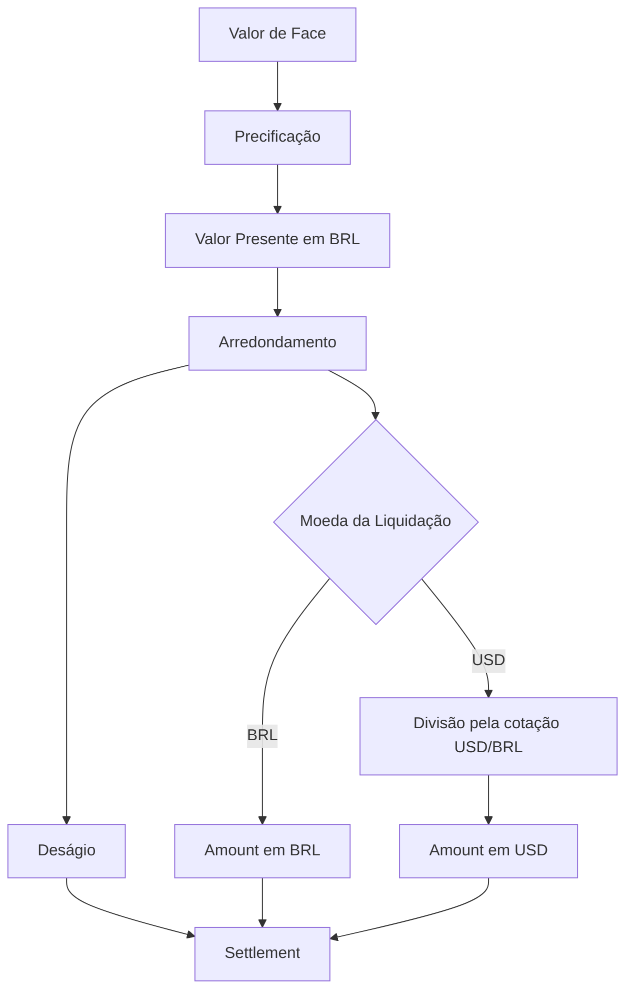

````md
# SRM Credit Engine — Diagrama ER

## Modelo de dados

O banco de dados do SRM Credit Engine é composto pelas entidades de cedentes, recebíveis, cotações cambiais e liquidações.

```mermaid
erDiagram

    CEDENTES {
        BIGINT id PK
        VARCHAR name
        VARCHAR document UK
    }

    RECEIVABLES {
        BIGINT id PK
        BIGINT cedente_id FK
        VARCHAR type
        DECIMAL face_value
        INTEGER term
        VARCHAR payment_currency
        VARCHAR status
    }

    EXCHANGE_RATES {
        BIGINT id PK
        VARCHAR from_currency
        VARCHAR to_currency
        DECIMAL rate
        TIMESTAMP effective_at
    }

    SETTLEMENTS {
        BIGINT id PK
        BIGINT receivable_id FK, UK
        DECIMAL amount
        DECIMAL present_value_brl
        VARCHAR currency
        DECIMAL fx_rate_used
        TIMESTAMP settled_at
    }

    CEDENTES ||--o{ RECEIVABLES : "possui"
    RECEIVABLES ||--o| SETTLEMENTS : "possui"
````

---

## Relacionamentos

### Cedente → Recebíveis

Um cedente pode possuir vários recebíveis.

```text
CEDENTE 1 ─────────── N RECEIVABLES
```

A relação é realizada por:

```text
receivables.cedente_id → cedentes.id
```

---

### Recebível → Liquidação

Um recebível pode possuir no máximo uma liquidação.

```text
RECEIVABLE 1 ─────────── 0..1 SETTLEMENT
```

A relação é realizada por:

```text
settlements.receivable_id → receivables.id
```

O campo `receivable_id` possui restrição de unicidade, reforçando a regra de idempotência da liquidação.

---

### Cotações cambiais

A entidade `EXCHANGE_RATES` é independente das demais entidades.

As cotações são cadastradas manualmente e possuem:

* moeda de origem;
* moeda de destino;
* valor da cotação;
* data e hora de efetividade.

Para uma liquidação em USD, o sistema seleciona a cotação USD/BRL com maior `effective_at`.

A cotação efetivamente utilizada é armazenada na liquidação através de:

```text
settlements.fx_rate_used
```

Isso permite preservar a cotação utilizada mesmo que novas cotações sejam cadastradas posteriormente.

---

## Principais campos financeiros

| Campo               | Entidade      | Descrição                                                  |
| ------------------- | ------------- | ---------------------------------------------------------- |
| `face_value`        | `RECEIVABLES` | Valor nominal do recebível                                 |
| `present_value_brl` | `SETTLEMENTS` | Valor presente calculado em BRL antes da conversão cambial |
| `amount`            | `SETTLEMENTS` | Valor efetivamente liquidado na moeda da operação          |
| `currency`          | `SETTLEMENTS` | Moeda utilizada na liquidação                              |
| `fx_rate_used`      | `SETTLEMENTS` | Cotação cambial utilizada na operação, quando aplicável    |

---

## Regra do deságio

O deságio não é armazenado como uma coluna independente na tabela `SETTLEMENTS`.

Ele é calculado a partir de:

```text
Deságio = face_value - present_value_brl
```

Exemplo:

```text
Valor de face:       R$ 100,00
Valor presente BRL:  R$  92,86
Deságio:             R$   7,14
```

Essa abordagem mantém o valor presente em BRL registrado na liquidação e permite calcular o deságio mesmo quando a operação é liquidada em USD.

---

## Fluxo dos valores



---

## Auditoria da liquidação

A entidade `SETTLEMENTS` preserva os principais dados financeiros da operação:

```text
Settlement
├── id
├── receivable_id
├── amount
├── present_value_brl
├── currency
├── fx_rate_used
└── settled_at
```

Isso permite identificar:

* qual recebível foi liquidado;
* quanto foi calculado em BRL;
* qual foi o valor efetivamente liquidado;
* em qual moeda ocorreu a liquidação;
* qual cotação foi utilizada;
* quando a operação ocorreu.

---

## Integridade e regras

### Unicidade da liquidação

Um recebível pode possuir no máximo uma liquidação:

```text
receivables 1 ─────── 0..1 settlements
```

A restrição de unicidade em:

```text
settlements.receivable_id
```

reforça essa regra no banco.

### Precisão financeira

Os campos monetários utilizam `DECIMAL` no banco e `BigDecimal` na aplicação.

A aplicação utiliza `RoundingMode.HALF_EVEN` para os arredondamentos definidos pela especificação.

### Conversão cambial

Para operações em USD:

```text
Valor de face
      ↓
Precificação em BRL
      ↓
Valor presente em BRL
      ↓
Deságio
      ↓
Conversão pela cotação USD/BRL
      ↓
Amount em USD
```

---

## Resumo do modelo

```text
CEDENTES
    │
    │ 1:N
    ▼
RECEIVABLES
    │
    │ 1:0..1
    ▼
SETTLEMENTS

EXCHANGE_RATES
    │
    └── utilizada na liquidação USD
```

O modelo mantém separadas as responsabilidades de cadastro do cedente, registro do recebível, armazenamento das cotações cambiais e registro da liquidação financeira.

```
```
